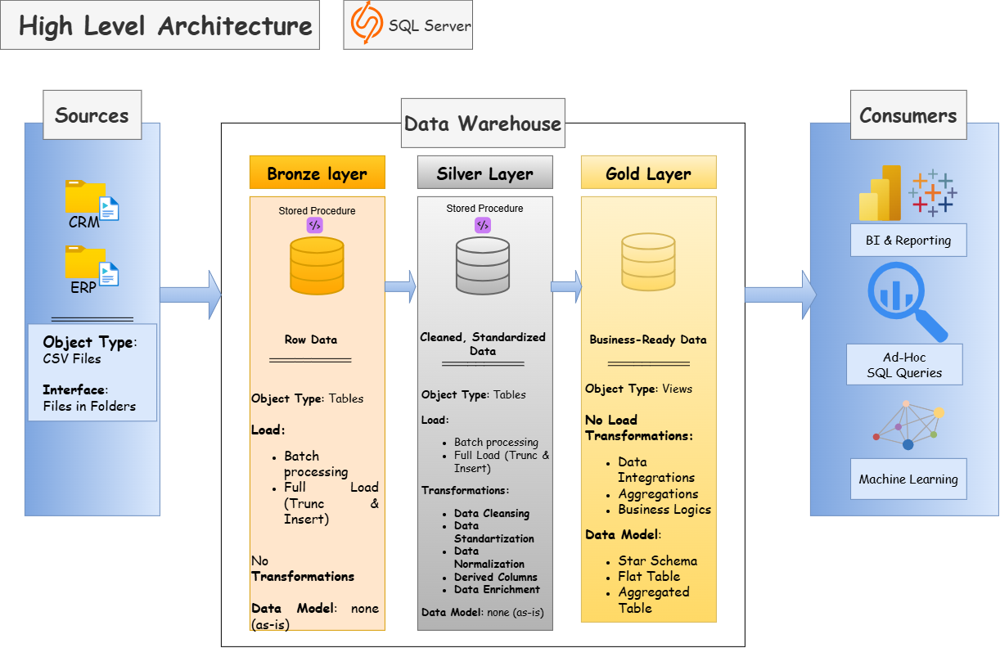

# sql-datawarehouse-project
Building a Data Warehouse with SQL Server, using ETL processes, data modeling, and analytics
Welcome to My Data Warehouse and Analytics Project! 👋

Welcome to my **learning project** focused on data warehousing, data architecture, and analytics.

I am currently studying to become a Data Analyst through Mate Academy, DataCamp, and educational YouTube channels such as Data With Baraa, Nikita Timoshenko, Learn Google Sheets & Excel Spreadsheets, Bro Code, techTFQ, Joey Blue, and Alex The Analyst.

This repository is based on a project created by **Baraa Khatib Salkini (Data With Baraa)**. I am recreating and adapting this project as part of my learning process in order to better understand how a data warehouse is built and how different components of a data system work together.

 ---

## My Learning Goals

The main goal of this project is to gain my first practical experience with:

- building a basic data warehouse;
- understanding data warehouse architecture;
- working with data from different sources;
- understanding how data is cleaned, transformed, and integrated;
- developing a basic understanding of data engineering concepts;
- improving my SQL skills through a practical project;
- understanding how data engineering and data analytics are connected.

## This project focuses on:

1. Data Architecture: Building a modern data warehouse based on the Medallion Architecture, with Bronze, Silver, and Gold layers.

2. ETL Pipelines: Extracting data from source systems, transforming it, and loading it into the data warehouse.

3. Data Modeling: Designing fact and dimension tables to support efficient analytical queries.

4. Analytics & Reporting: Developing SQL-based reports and dashboards to provide meaningful business insights.


## Project Requirements

### Building the Data Warehouse (Data Engineering)

#### Objective 
Develop a modern data warehouse using SQL Server to consolidate sales data, enabling analytical reporting and informed decision-making. 

#### Specifications 
- **Data Sources**: Import data from two source systems (ERP and CRM) provided as CSV files. 
- **Data Quality**: Cleanse and resolve data quality issues prior to analysis.
- **Integration**: Combine both sources into a single, user-friendly data model designed for analytical queries.
- **Scope**: Focus on the latest dataset only, historization of data is not required.
- **Documentation**: Provide clear documentation of the data model to support both business stakeholders and analytics teams.

---

### BI: Analytics & Reporting (Data Analytics)

#### Objective
Develop SQL-based analytics to deliver detailed insights into:
- **Customer Behavior**
- **Product Performance**
- **Sales Trends**
    
These insights empower stakeholders with key business metrics, enabling strategic decision-making.

  ---
# Data Architecture

The data architecture for this project follows Medallion Architecture Bronze, Silver, and Gold layers:



1. Bronze Layer: Store raw data as-is from the source systems. Data is ingested from CSV Files into SQL Server Database.

2. Silver Layer: This layer includes data cleansing, standardization, and normalization processes to prepare data for analysis

3. Gold Layer: Houses business-ready data modeled into a star schema required for reporting and analytics

# The Repository Structure
```text
data-warehouse-project/
│
├── datasets/                                                         # Raw datasets used for the project (ERP and CRM data)
│
├── docs/                                                             # Project documentation and architecture details
│   ├──20.09.2026. the_Data_Architecture (Draw.io).drawio             # Draw.io file shows the project's architecture
├   ├──LICENSE                                                        # License information for the repository
│   ├── Sales_Data_Mart_(Star Schema).png                             # The Data Star Schema
│   ├── data_architecture.png                                         # Diagram of the data architecture
│   └── data_flow.png                                                 # Diagram og the Data flow
│   └── integration_model.png                                         # the Data Integrational model
│
├── scripts/                                                          # SQL scripts for ETL and transformations
│   ├── bronze/                                                       # Scripts for extracting and loading raw data
│   ├── silver/                                                       # Scripts for cleaning and transforming data
│   └── gold/                                                         # Scripts for creating analytical models
│
├── tests/                                                            # Test scripts and quality files (for silver and gold layers)
│
├── README.md                                                         # Project overview and instructions
```

# About Me

Hi! I'm Iryna, a second-year Management student who is interested in data analytics.

I am currently learning SQL, Excel, Google Sheets, Tableau, and other tools that are useful for working with data. My goal is to continue developing my technical and analytical skills and eventually start my career as a Junior Data Analyst.

I'm still at the beginning of my journey, but I enjoy learning by building practical projects and trying to understand not only how something works, but also why it works.
